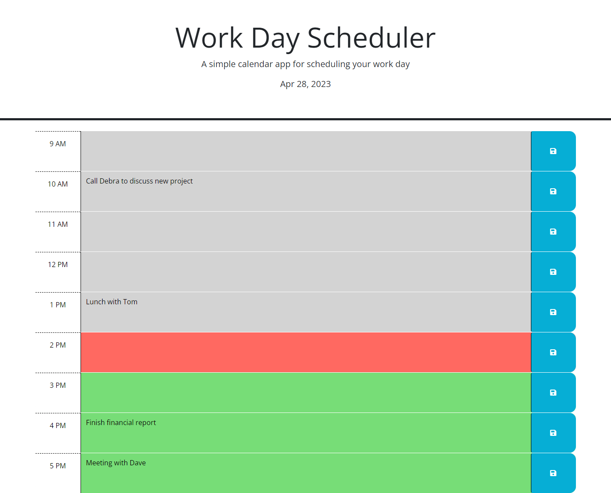

# Workday Scheduler

## Description

The goal of this project was to create a simple calendar application that allows a user to save events for each hour of the work day. This web application runs in the browser and features dynamically updated HTML and CSS powered by jQuery.

- When user opens the planner, they are able to see current day at the top.
- When user scrolls down, they are presented with timeblocks for standard business hours. 
- Each timeblock is color coded to indicate whether it is in the past (grey), present (red), or future (green).
- When user clicks on any color block, they can enter an event. To save event, user needs to click on save button on the right. 
- If page is refreshed, event will still display for the user since data is saved to Local Storage in the browser. 

## Usage

Web application is located at: https://vlada-caban.github.io/workday-scheduler/

Screenshot of application made on April 28, 2023 at 2pm.

9am-1pm are all color coded grey for past time, 2pm is red for present and 3pm-5pm are green for future. This is dynamically updated on page load based on the current hour. 

## Credits

Starter code developed and provided by Columbia Coding Bootcamp.
Bootstrap was used for styling.
Day.js library was used for today's date.

## License

Please refer to the LICENSE in the repo.